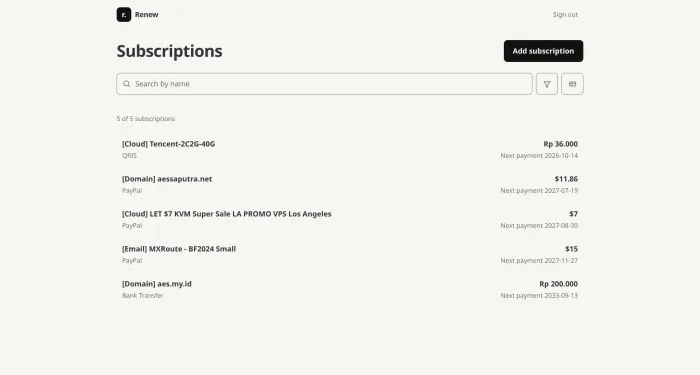

# Renew


A personal, single-owner dashboard for [Wallos](https://github.com/ellite/Wallos) subscriptions. Renew provides a mobile-friendly view for browsing and managing subscriptions; Wallos remains the source of truth.



## What it does

- Browse active subscriptions with search, category and payment-method filters.
- View subscription details, add, edit and delete subscriptions, and manage their reminders.
- Sign in with Pocket ID using OIDC Authorization Code + PKCE. Access is restricted to one configured subject; there is no local password.
- Install as a PWA. The offline page is available without caching private subscription pages.

Categories, payment methods, currencies and notification channels are managed in Wallos, not Renew. Forms work without JavaScript; list search and filters require JavaScript.

## Run locally

Requires Node.js 24 and npm, a running Wallos instance with an API key, and a Pocket ID OIDC client. Register `<ORIGIN>/auth/callback` as the client's redirect URI.

```sh
npm ci
cp .env.example .env
# Edit .env with your own values
npm run dev
```

Open the address printed by Vite. For local development, set `ORIGIN` to that exact address. Keep `.env` out of version control.

| Variable | Purpose |
| --- | --- |
| `ORIGIN` | Exact application origin (HTTPS in production) |
| `OIDC_ISSUER`, `OIDC_CLIENT_ID`, `OIDC_CLIENT_SECRET` | Pocket ID issuer and client credentials |
| `OIDC_ALLOWED_SUB` | The only Pocket ID subject allowed to sign in |
| `SESSION_SECRET` | Secret for signed session cookies; use at least 32 bytes |
| `WALLOS_BASE_URL`, `WALLOS_API_KEY` | Wallos URL and server-side API key |
| `HOST`, `PORT` | Host and port for the local Node server |

To run the Node production build locally:

```sh
ADAPTER=node npm run build
npm start
```

Renew deploys with the Vercel adapter by default. Configure the same application variables in the deployment environment. `HOST` and `PORT` are for the Node adapter, not Vercel. Missing authentication or Wallos configuration fails closed; the API key is never sent to the browser.

> [!NOTE]
> Sessions expire after 7 days of inactivity or 30 days total. Changing `SESSION_SECRET` signs everyone out. Logging out ends the Renew session, not the Pocket ID session.

## Check the project

```sh
npm run check
npm run lint
npm run test
npm run build
```

Tests use local mock services, not production subscriptions. `npm run test` builds with the Node adapter before running the unit and integration tests. The Wallos API contract reference is in [`openapi.yaml`](openapi.yaml).

Built with SvelteKit, Svelte 5, TypeScript and Tailwind CSS 4.
